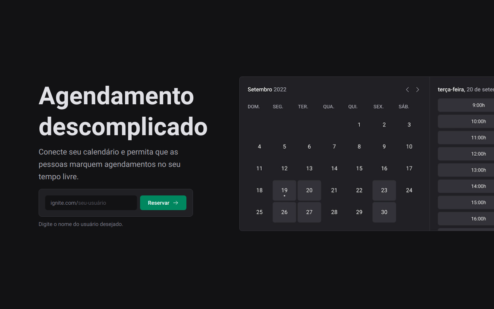

# React JS - Ignite - Ignite Call




Aplicação que permite visualizar e agendar horários nos períodos disponíveis, cadastrados pelo usuário, em sua própria agenda.

Integra com o Google Calendar.

#

## Funcionalidades

- Cadastro de usuários via Google oAuth;
- Criação de um agenda com dias e horários personalizados;
- Visualização de dias e horários disponíveis de uma agenda;
- Marcação de horário com o usuário dono de uma agenda;
- Sincronização da agenda da aplicação com o Google Calendar.


## Stack utilizada

- ReactJS
- NextJS
- TypeScript
- Prisma


## Rodando localmente

1. Clone o projeto

```bash
  git clone https://github.com/fellipebastos/ignite-call.git
```

2. Entre no diretório do projeto

```bash
  cd ignite-call
```

3. Instale as dependências

```bash
  npm install
```

4. Configure o arquivo `.env`

5. Inicie o servidor

```bash
  npm run dev
```


## Autores

- [@fellipebastos](https://www.github.com/fellipebastos)

